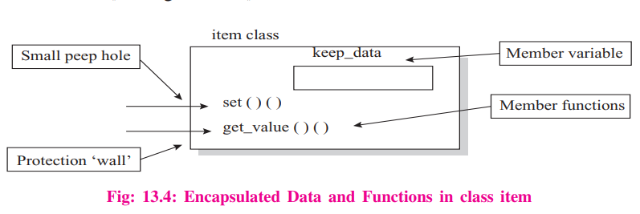

# What is object oriented programming?

<p>
OOP is a consept which we program. The idea is how to manipulate the data rather than duplicate the same code for manipulation different data. The OOP is way to look at the complex outside world in an abstract and conseptual way. OOP helps programmers to work more effective than one did with procedure-oriented programing. </p>

### The four fundementals of OOP:

    - Inheritance
    - Encapsulation
    - Polymorphysm
    - Abstraction

### Advanteges of OOP:

    - Code reusability
    - reduce code complexity
    - Scalable

### What are the basic concepts of OOP?

    - Objects
    - Classes
    - Data abstraction
    - Data encapsulation
    - Inheritance
    - Polymorphism

### What are the main principles of OOP?

### Encapsulation

<p> The idea with encapsulation is to protect data of an object from clients to directly manipulate the private data. With another words, the objects data can only by manipulated by its own methods. The client can only send masseges to perform an method with different objects.</p>

> Wrapping up of data and funcitons into a single unit is called as data encapsulation

**Code example to illustrate encapsulation:**

```py
# Making a simple class structure

class Company:
    def __init__(self) -> None:
        # Protected
        self._project = "NLP"


class Employee(Company):
    """
    Employee class inherit from "Company" class
    """
    def __init__(self, name, project, salary) -> None :
        self.name = name
        self._project = project
        self.__salary = salary
        Company.__init__(self)

    # public instance methods
    def show(self):
        #Private members are accessible from a class
        print("Name: ", self.name, 'Salary:', self.__salary)

emp = Employee("Shahin","Hydro.Plant", 900)
emp.show()
print(emp._Employee__salary) # one way to get the private members of the Empolyee

```

**Type of encapsulation**:

- public
- private
  -protected

### Why use encapsulation?

- Security
- Data Hiding
- Simplicity
- aesthetics

**Example from the book:** <br></br>_In the Figure 13.4 item is a class which has keep_data as member variable whocj cannot be accessed from outside directly. It can be accessed only via th member functions set() and get_value()._



### Inheritance

Inheritance is inheritation of the superclasses methods and variabels.

The subclass can inherite is differente. Modulatrity is when components can be used different places. It can be sand alone with out to change a lot of things.

    - Modular codebase
    - Code Reusability
    - Less development

Refactor: reborn. Does not change the functionality but it makes the code more readabl and clean. [Book Clean Code](https://www.adlibris.com/no/bok/clean-code-9780132350884?gclid=Cj0KCQjw08aYBhDlARIsAA_gb0d26TUkT5wuaib-39uA1XshOIGkSJ2ZtsB0KRwzF6VuqeQQVSCMnRgaAvEsEALw_wcB)

### Abstraction

Abstraction is an natural extention of encapsulation. It is the representation og essentional features without including the backround details. Take a "switch board" as example, you only press a certain button to do some actions. You need not know the internal working of thes switches. What is happening behinde the scene is hidden for you.

Facebook GUI is an example of abstraction in the real world.

**Abstraction importance**

    - Prevence code repetitions
    - Improve flexibility
    - Working in lagre teams

### Polymorphism

Polymorphism means multiple form of the same thing. It is the consept that objects perform different way in different situations. Take an "ADD" funciton as example: If oyu add to integers you will get the sum of the numbers. But with the strings you will get a combines string.

**Example:**

```python
Numbers = sum(1, 4)                 # The result = 5
String = sum("Poly", "morphism")    # The result = "Polymorphism
```

**Different explanations from classroom:**

> _Polymorphism is when you can make subclases different from the super class._

> _The main consept of poly is method overriding._
