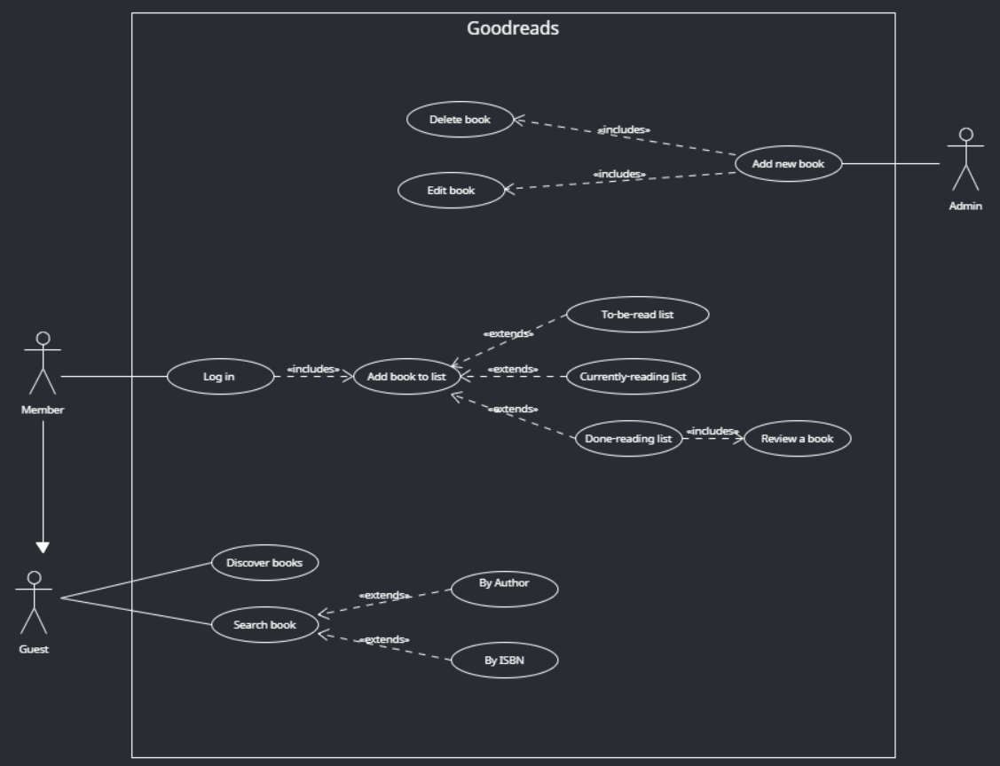

# Problem statement

Our app gives a detailed view over a user's collection of books.

# Actors

- App members
- guests
- system admin

# Req.

- **Guest:** :

  - search a book
  - Read a book's reviews

- **Member:**
  - log in
  - track their current reading
  - track to be read
  - track read reviews
  - review book

**System admin:** add books, edit added books,remove books

