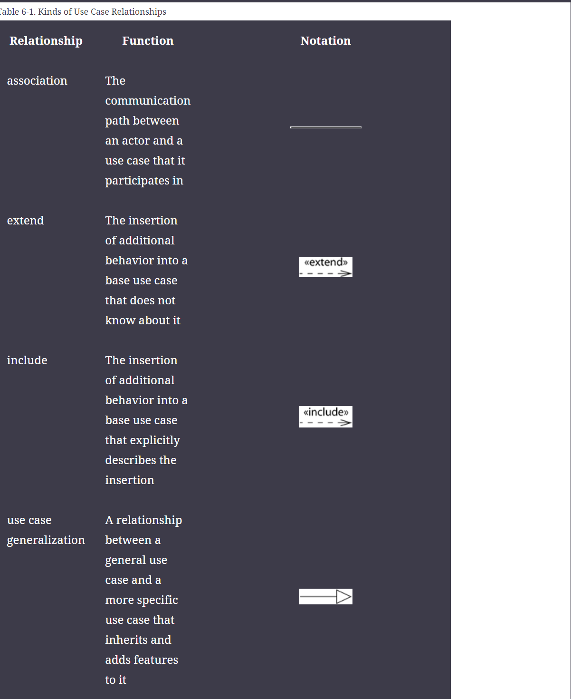
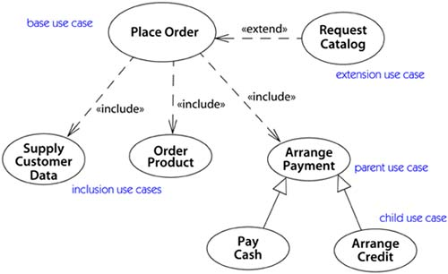
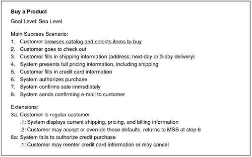
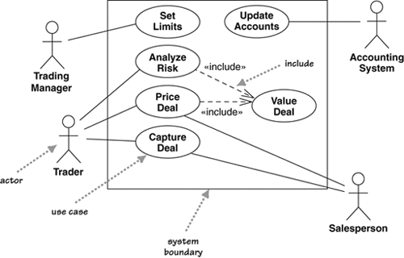

[Link to Table 6-1 Kinds of Use Case Relationship](https://learning.oreilly.com/library/view/unified-modeling-language/0321245628/0321245628_ch06lev1sec3.html#:-:text=Relationship,features%20to%20it)

The include and extend relationships are drawn as dashed arrows with the keyword «include» or «extend». The include relationship points at the use case to be included; the extend relationship points at the use case to be extended.

Use Case example:

It is important to remember that use cases represent an external view of the system. As such, don’t expect any correlations between use cases and the classes inside the system.

A big danger of use cases is that people make them too complicated and get stuck. Usually, you’ll get less hurt by doing too little than by doing too much. A couple of pages per use case is just fine for most cases. If you have too little, at least you’ll have a short, readable document that’s a starting point for questions. If you have too much, hardly anyone will read and understand it.

### System and business Use Case

a **system** use case is an interaction with the software, whereas a **business** use case discusses how a business responds to a customer or an event.

**Example of use case text:**

### Leveles of Use Case:

- Sea-level
  - Explains the interaction between a primary actor and the system.
- Fish level
- Kite-level

### How to describe Use Case

The best way to think of a use case diagram is that it’s a graphical table of contents for the use case set. It’s also similar to the context diagram used in structured methods, as it shows the system boundary and the interactions with the outside world. The use case diagram shows the actors, the use cases, and the relationships between them:

- Which actors carry out which use cases
- Which use cases include other use cases

A **pre-condition** describes what the system should ensure is true before the system allows the use case to begin. This is useful for telling the programmers what conditions they don’t have to check for in their code.

A **guarantee** describes what the system will ensure at the end of the use case. Success guarantees hold after a successful scenario; minimal guarantees hold after any scenario.

A **trigger** specifies the event that gets the use case started.
