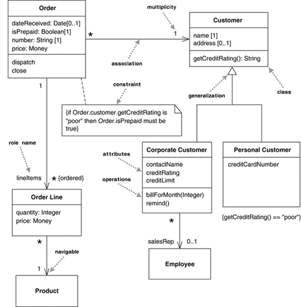
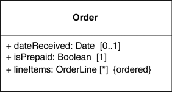
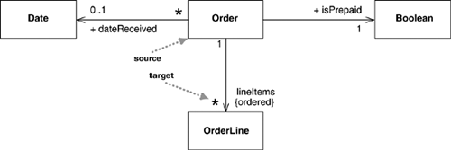
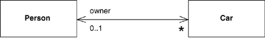
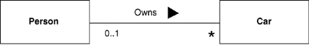

# Class Diagram

From software developer to software engineer!

    - Use creativity
    - Inventing stuff

### Description

    - Describs the types objects can be created
    - Attributes
        - bounded: parameters of the constructor
    - Methods (Operations)
    ---------------------------------
    - Relationship between the object

### Relationship

    - Association: A and B call each other
    - Solid ine between

### Extra notes

    - The modularity of the system should be in the class diagram already.
    - When the design is modular so should the implementation of the system be.
    -

## Notes from UML Distilled

A **class diagram** describes the types of objects in the syatem and the static relationship that exists among them. It also show the features, that is the properties and operations of a class.

**A simple example of a class diagram:**

## Properties

### Attributes

    - Describes a property as a line of text within the class box
    - The only name is necessary but the it could also contain more info like:
        - name: String [1] = "Untitled" {readOnly}

### Association

Association is the other way to notate a property. Even that Attributes and association have different notations, they are the same. Se example below.

So we know that the they are the same, so why use one or the another. Answere from **UML Distilled**

> I tend to use attributes for small thinks, such asdates or Booleans-in general, value types and associations for more significant classes, such as customers and orders.

## Multiplicity

The **multiplicity** of a property is an indication og how many objects may fill the property. The most common multiplicities: - 1 (Eks: An order must have exactly one customer) - 0..1 (A corporate customer may or mat not have a single sale rep.) - \* (Zero or more)

## Bidirectional Associations

**Example of bidirectional association:**

**Using a verb phrase to name an association**

# Interface class

**Interface:** Classes implement interfaces, denoted by Generalization.

    - At a high level, an interfaceacts as a blueprint for designing classes.
    - Can obtain only method declarations
    - Interfaces are implementet in the interface file and can`t not be overriden in the other classes.
    - A -------------- B
    - The interface making methods and hiding all the data, the inheritants inherit the classes.

# Enumerations

# DataTypes

# Relationsship between objects

    - As computer systems grow, you have to worry more and more about controlling dependencies.
    - If out of controll? each change to a system har a broad ripple effect as more and more things have to change.
